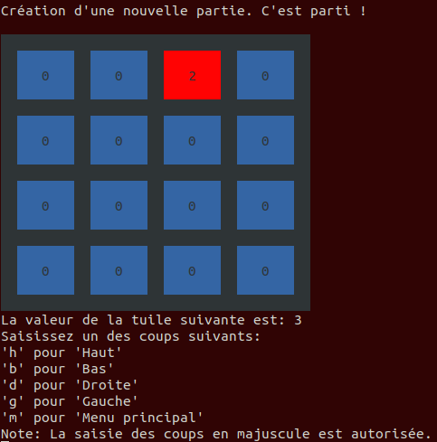
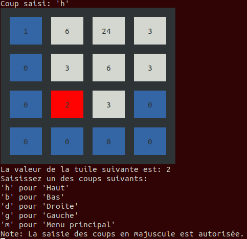

# Threes
Le but de ce projet est de programmer en langage Python le jeu Threes (variante du jeu 2048) qui se joue sur une grille de 4*4 cases.

## Organisation du package jeu_threes

Le programme se divise en 5 modules Python : 

- tiles/tiles_acces : module contenant les fonctions permettant la lecture et la modification de la tuile
- tiles/tiles_moves : module contenant les fonctions relatives aux mouvements des tuiles du plateau
- ui/user_entries: module contenant les fonctions relatives à la saisie des coups du joueur
- life_cycle/cycle_game : module contenant les fonctions permettant à l'utilisateur de joueur une partie
- game/play : module contenant les fonctions relatives à l'affichage du plateau de jeu

## Pour lancer le jeu sur votre terminal : 

- python doit être installé ainsi que la bibliothèque termcolor (via la commande : pip install termcolor)
- exécuter le fichier app.py (via la commande : python app.py)

## Règles pour se déplacer : 

- "h" pour haut
- "b" pour bas
- "g" pour gauche
- "d" pour droite
- "m" pour menu

## Screens du jeu 

- Commencer Une Partie

- Partie En Cours

- Partie Terminée

À vous de jouer !
